# Puma560ManipulatorAlgorithmsDemonstration
This repo contains a Simulink (Simscape) model and supporting MATLAB scripts to analyse how different non-linear control methods can be used to control the PUMA 560.
There are both force and position control algorithms. Force control algorithms, when run, demonstrate the manipulator's ability to interact with the environment in a stable manor. 

A description of some of the most notable algorithms can be found below.

## Computed Torque/Inverse Dynamics
This algorithm assumes perfect knowledge of the manipulator, including the inertia and geometry of each link. In practice this is not the case. This algorithm's fault can be seen as it fails to track the desired trajectory because certain parameters in the equations are intentionally wrong.

## Sliding Adaptive Control
This algorithm is made up of two parts. Namely the adaptive law and the control law. The adaptive law is responsible for iteratively updating the estimate of unknown model parameters. This estimate is performed on a need to know basis, meaning that the estimated parameters _may_ not be accurate but they are sufficient to guarantee accurate tracking of the desired trajectory. The adaptive law using a regressor matrix where the rows are linear combinations of the unknown model parameters. The regressor matrix is formed assuming that each link of the robot has a unkown point mass located some unkown distance along the z-axis of the frame located at the proxal end of the link. The manipulator links in reality have a mass distribution however because the algorithm working on a need to know basis it can still accurately tracking the desired trajectory. 

The control law uses the estimated model parameters to implement sliding mode control. The sliding surface is a hyperplane defined by the sum of joint positions and velocity errors. The derivative of the sliding surface contains the control input, joint torque, so the state of the system successfully converges to the sliding surface during the reaching phase of the control. Once the state of the system is on the hyperplane, the sliding mode controller will ensure the state does not leave the hyperplane. While on the hyperplane, the state will follow the dynamics described by the sliding surface equation when the equation is set equal to zero.

There are parameters which can be tuned to find optimal performance. For example the adaptation rate can be adjusted. To small a rate and the adaptation will not be fast enough to ensure tracking of the desired trajectory. To high a rate may cause numerical issues in simulation and more importantly may results in the controller demanding greater torque or a higher switching frequency than a real system can offer. The effect of the adaptation rate can be seen in the animations below. The green spline is the desired trajectory of the end effector and the yellow one is the trajectory of the end effectors true position.

|                            Fast Adaptation Rate                                |                            Slow Adaptation Rate                                 |
|:------------------------------------------------------------------------------:|:-------------------------------------------------------------------------------:|
|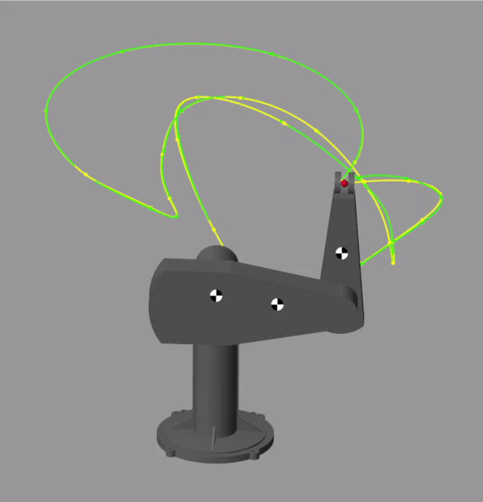| 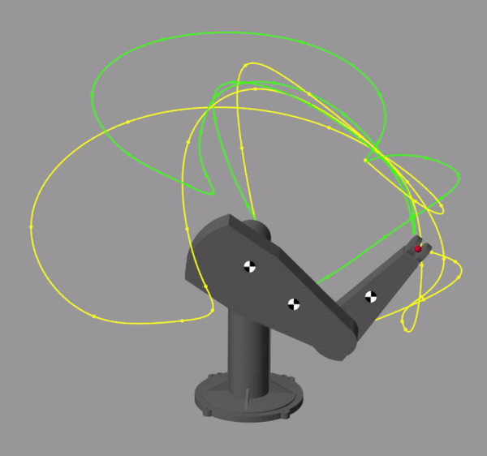|

## Sliding Robust Control 
This algorithm also uses sliding mode control in the same way as sliding adaptive control. They key difference here is that the algorithm assumes complete knowledge of the manipulator _and_ assumes knowledge on the upper bounds of disturance. The units of disturbance in this algorithm are rad/s^2 causes by external forces. Note that external forces could also be forces caused by imperfect knowledge of the manipulator parameters. A vector of maximum joint disturbances is defined and used to create a controller that can guarantee tracking of a tracking when the disturbances to the system do not exceed those defined in the disturbance vector. The implementation in the Simulink model is desired so that the manipulator can follow any given trajectory so long as the forces applied along any axis of the end effector frame do not exceed 200N. See the full project write for more details on how the disturbance vector is calculated. The animations below demonstrate when the external forces are within and exceed the disturbance limits of the algorithm. The figure below the animations shows the magnitude of joint disturbances plotted againts joint 2 & 3 positions. The maximum value for each joint disturbance is found using the optimization toolbox in MATLAB.

|                            Disturbance Within Limits                           |                            Disturbance Exceeds limits                           |
|:------------------------------------------------------------------------------:|:-------------------------------------------------------------------------------:|
|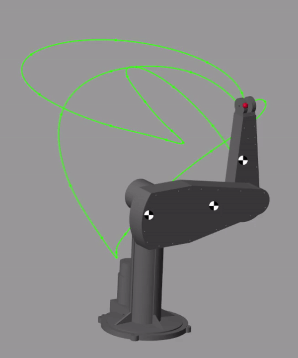   | 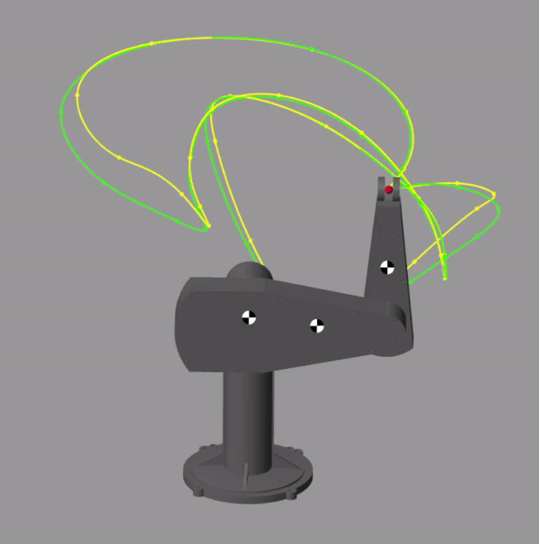   |

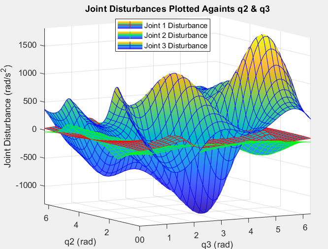

## Impedance Control
The animation below shows the manipulator handling contact with a moving wall while an impedance controller is operating. This impedance control law is one where force measurements are not needed an as a result the desired inertia matrix of the system cannot be specified. This controller is operating in task space as the manipulator is interacting with objects that are described easiest in task space coordinates.

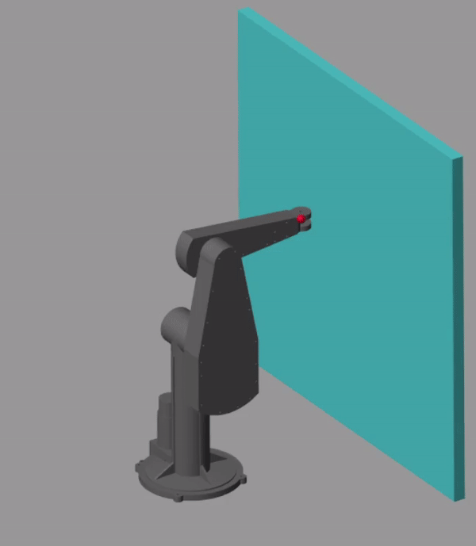 

## Parrellel Force Motion Control
This control law attempts to satisfy desired position trajectories as well as desired contact forces at the end effector. The contribution force control to joint inputs is calculated as the solution to a differential equation (DE) described in the project write up. This DE is implemented as a filter which contains an integrator. As a result, the manipulator will favour following the desired contact force profiles over the desired position trajectories when the two conflict with one another. An animation below shows the algorithm in action. Below the animation there are two plots which demonstrate how meeting force requirements take priorety. 

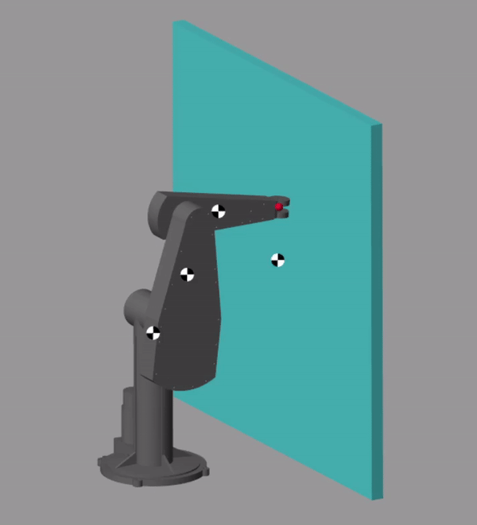 

|                            Desired & True Position Plot                        |                            Desired and True Force Plot                          |
|:------------------------------------------------------------------------------:|:-------------------------------------------------------------------------------:|
|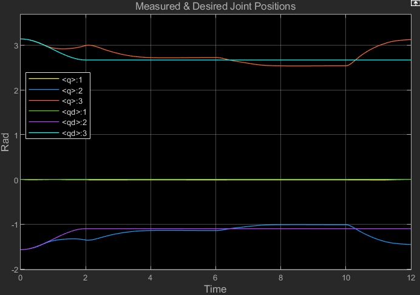   | 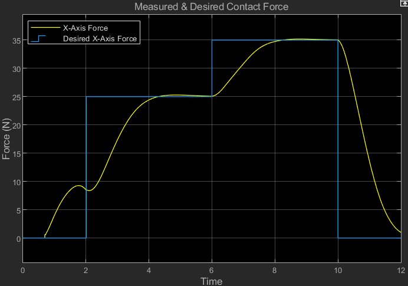   |

## Hybrid Force Motion Control
Unlike parelle force motion control, this algorithm is intended to be used when both requirements (position & force) can be meet. This can lead to unstable performance when both requirements conflict with each other because the position and force parts of the algorithm will "compete with each other". Adding a damping term to the force control part, where damping is with respect to the rate of change of task space forces. Animations of the two senarios can be seen below. Further below, plots showing the force tracking can be seen. It should be noted that because there is no integral term in this control law, the desired forces & trajectories are not guaranted to be satisfied, rather the system will often settle in some equilibrium state being "pulled" equally as hard in oppositie directions towards two different states that satisfy force or trajectory requirements respectively.

|                            Oscillating Force/Motion Control                    |                            Force/Motion Control with Damping Term               |
|:------------------------------------------------------------------------------:|:-------------------------------------------------------------------------------:|
|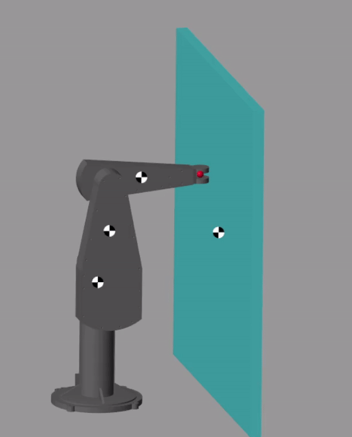   | 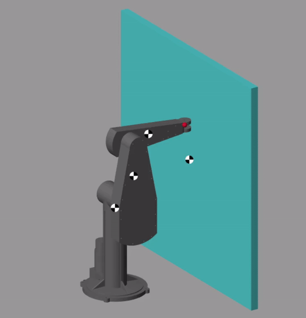     |

|                            Oscillating Force/Motion Control                    |                            Force/Motion Control with Damping Term               |
|:------------------------------------------------------------------------------:|:-------------------------------------------------------------------------------:|
|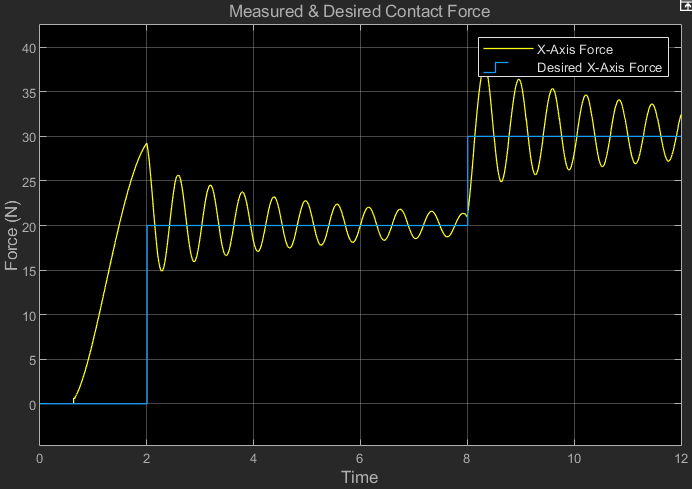   | 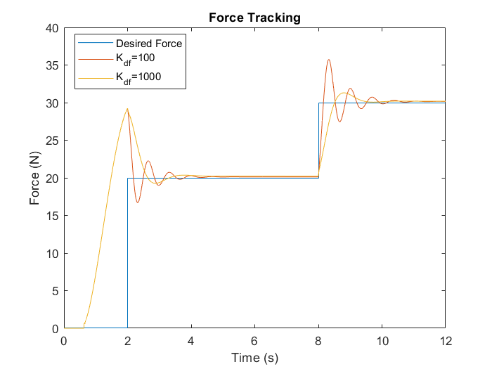   |
